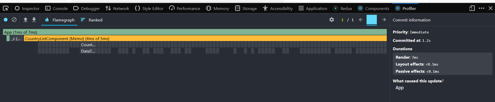
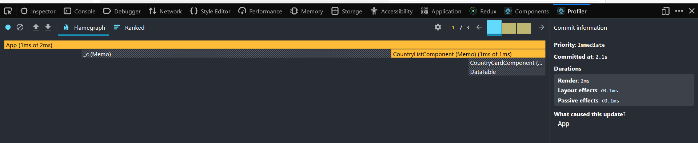
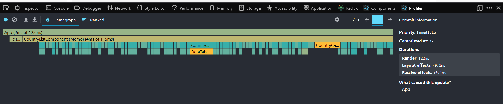
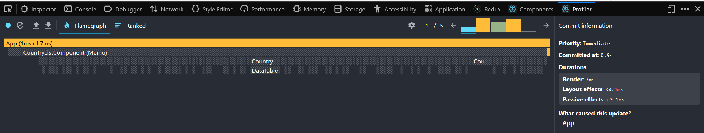

Before optimization

1. Sorting countries 

2. Searching for a country

3. Selecting a different year

4. Toggling columns

After optimization
1. Sorting countries 

2. Searching for a country

3. Selecting a different year

4. Toggling columns

Conclusion
On average, all indicators increased by 25 times, with the exception of sorting by year, where the indicator worsened by 4.5 times.

